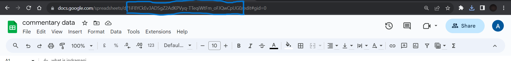

# Django Google Sheets Integration with Twilio Notifications

This Django project facilitates the collection of user responses to a form, updating a corresponding spreadsheet, and sending notifications via Twilio. Signals are employed to ensure that model changes are not required when sending SMS notifications.

## Features

- Collects user responses to a form
- Updates a Google Spreadsheet with user responses
- Sends notifications to the client via Twilio

## Tech Stack

- Django
- Google API (Google Sheet API, Google Drive API)
- Twilio API

## Getting Started

### Prerequisites

Ensure you have the following prerequisites installed:

- Python
- Virtualenv (optional but recommended)

### Installation and Configuration

```bash
# Clone the repository:
git clone https://github.com/your-username/your-project.git       
cd your-project       
```
### Set up and activate a virtual environment:
```
python -m venv venv       
source venv/bin/activate          # On Windows, use `venv\Scripts\activate`  
```

### Install dependencies:
```
pip install -r requirements.txt     
```
### Copy the provided example.env to create a new .env file.

### Set up Google API:
- Create a project on the Google Cloud Platform.
- Enable Google Sheet API and Google Drive API.
- Create credentials for the service account, download the JSON key, and save it in the same loaction as the project.
- Open an untitled Google Sheet and give access to the user mentioned in the JSON key.
- Update the json_file_path in signals.py with the path name of the downloaded API key.
- Find the sheet ID as depicted in the instructions.    


### Set up Twilio:
- Obtain twilio_account_sid and auth_token by creating an account on the Twilio official website.
- Use these credentials in the .env file.

## Usage
```
#run the development server     
python manage.py runserver    
```

- Create the forms at ```http://127.0.0.1:8000/sheets/form/``` ,using the fields: `form_id` and `form_name`     
- Create the questions at ```http://127.0.0.1:8000/sheets/question/``` using the fields: `question_id`, `form`, `question_text`, and `question_type`. Note that `form` is the foreign key for the form       
- Submit responses at ``` http://127.0.0.1:8000/sheets/submit-response/``` with fields: `user_id`, `answers`, `form`, `question`. Here, `form` and `question` are foreign keys, and user_id and answers represent the user and their responses, respectively.   

The Google Sheets API collects and updates this response, and Twilio sends the corresponding message.


